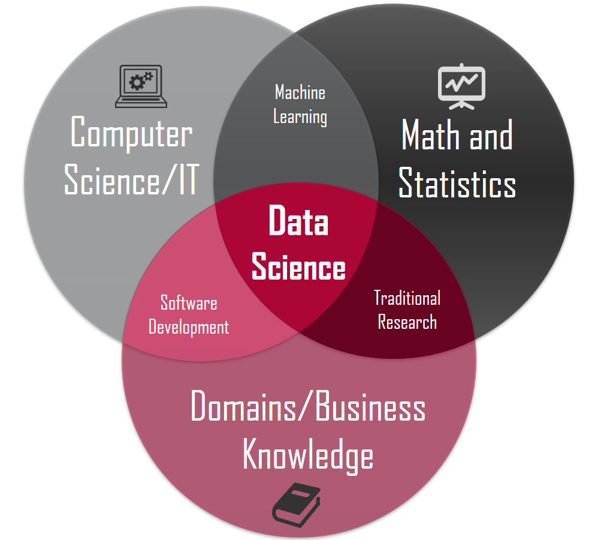
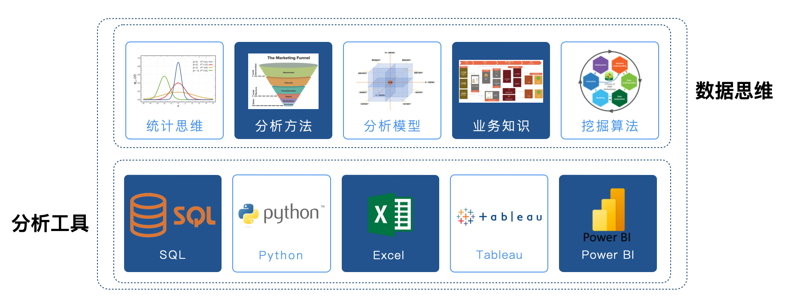

## 数据分析概述

当今世界，各行各业对信息技术的依赖程度在不断加深，每天都会有大量的数据产生，我们常常会感到数据越来越多，但是要从中发现有价值的信息却越来越难。这里所说的信息，可以理解为对数据集处理之后的结果，是从数据集中提炼出的可用于支撑和指导决策的东西，而**从原始数据中抽取出有价值的信息**的这个过程我们就称之为**数据分析**，它是数据科学的重要组成部分。

> **定义1**：数据分析是有针对性的收集、加工、整理数据并采用统计、挖掘等技术对数据进行探索、分析、呈现和解释的科学。
>
> **定义2**：数据分析是通过收集、整理和分析数据，从中提取有价值的信息和洞察，以支持决策和优化过程的活动。（GPT-4o）
>
> **定义3**：数据分析是通过系统性的收集、整理、处理、检验和解释数据，从中提取有价值的信息、形成结论并支持决策的过程，其核心是利用统计、算法和逻辑方法揭示数据背后的规律、趋势或关联。（DeepSeek）

对于想从事数据分析工作的人来说，需要掌握两个部分的技能，一是“数据思维”，二是“分析工具”，如下图所示。

上图中，分析工具部分其实是比较容易掌握的，像 SQL 或 Python 这样的编程语言，只要经过系统的学习和适量的练习，大部分人都是可以驾驭的；像 Power BI、Tableau 这样的商业智能工具，更是让我们通过“拖拉拽”操作就能完成数据的可视化并在此基础上产生商业洞察，上手难度会更低。相反，数据思维部分的内容对大多数新手来说是不太容易驾驭的，例如“统计思维”，很多人在读书的时候都学习过“概率论和统计学”这样的课程，但是当面对实际的业务场景时，却很难将这些知识映射到业务场景来解决现实的问题。此外，如果没有掌握基本的分析方法、没有理解常用的分析模型，没有相关业务知识的积累，即便我们拿到再多有用的数据，也会感觉无从下手，更不用说产生业务洞察发现商业价值了。所以，数据思维这个部分，除了系统的学习相关知识技能，还需要不断的在实际业务场景中积累和沉淀。

### 数据分析师的职责

HR在发布招聘需求时，通常将数据工程、数据分析、数据挖掘等岗位都统称为数据分析岗位，但是根据工作性质的不同，又可以分为偏工程的**数据治理方向**、偏业务的**商业分析方向**、偏算法的**数据挖掘方向**、偏应用的**数据开发方向**、偏产品的**数据产品经理**。我们通常所说的数据分析师主要是指**业务数据分析师**，很多数据分析师的职业生涯都是从这个岗位开始的，而且这个岗位也是招聘数量最多的岗位。有些公司会将业务数据分析师归属到具体的业务部门（市场、运营、产品等），有些公司有专门的数据部门（数据分析团队或数据科学团队），还有些公司数据分析师会直接服务高层决策，属于企业战略部门。正因如此，你在招聘网站上看到的把数据分析师称为**数据运营**、**商业分析师**、**BI工程师**就不会感到奇怪了。通常，我们在招聘网站看到的对业务数据分析师岗位职责（JD）的描述如下所示：

1. 负责相关报表的输出。
2. 建立和优化指标体系。
3. 监控数据波动和异常，找出问题。
4. 优化和驱动业务，推动数字化运营。
5. 找出潜在的市场和产品的上升空间。

根据上面的描述，作为业务数据分析师，我们的工作不是给出一个简单浅显的结论，而是结合公司的业务，完成**监控数据**、**揪出异常**、**找到原因**、**探索趋势**等工作。不管你是用 Python 语言、Excel、Tableau、SPSS或其他的商业智能工具，工具只是达成目标的手段，**数据思维是核心技能**，从实际业务问题出发到最终**发现数据中的商业价值**是终极目标。数据分析师在很多公司只是一个基础岗位，精于业务的数据分析师可以向**数据分析经理**或**数据运营总监**等管理岗位发展；对于熟悉机器学习算法的数据分析师来说，可以向**数据挖掘工程师**或**算法专家**方向发展，这些岗位除了需要相应的数学和统计学知识，在编程能力方面也比数据分析师有更高的要求，可能还需要有大数据存储和处理的相关经验。

这里顺便说一下其他几个方向，数据治理岗位主要是帮助公司建设数据仓库或数据湖，实现数据从业务系统、埋点系统、日志系统到数据仓库或数据湖的转移，为后续的数据分析和挖掘提供基础设施。数据治理岗位对 SQL 和 HiveSQL 有着较高的要求，需要熟练的使用 ETL 工具，此外还需要对 Hadoop 生态圈有较好的认知。作为数据产品经理，除了传统产品经理的技能栈之外，也需要较强的技术能力，例如要了解常用的推荐算法、机器学习模型，能够为算法的改进提供依据，能够制定相关埋点的规范和口径，虽然不需要精通各种算法，但是要站在产品的角度去考虑数据模型、指标、算法等的落地。

### 数据分析师的技能栈

数据分析师的技能栈也包括硬技能和软技能，以下是我对这个职位的理解，仅供参考。

1. 计算机科学（数据分析工具、编程语言、数据库）
2. 数学和统计学（数据思维、统计思维）
3. 人工智能（机器学习和深度学习算法）
4. 业务理解能力（沟通、表达、经验）
5. 总结和表述能力（总结、汇报、商业 PPT）

当然，对于一个新手来收，不可能用短时间掌握整个技能栈的内容，但是随着这份工作的深入，上面提到的东西多多少少都会涉猎到，大家可以根据实际工作的需求去深耕其中的某个或某些技能。

### 数据分析通用流程

我们提到数据分析这个词很多时候可能指的都是**狭义的数据分析**，这类数据分析主要目标就是生成可视化报表并通过这些报表来洞察业务中的问题，这类工作一般都是具有滞后性的。**广义的数据分析**还包含了数据挖掘的部分，不仅要通过数据实现对业务的监控和分析，还要利用机器学习算法，找出隐藏在数据背后的知识，并利用这些知识为将来的决策提供支撑，具备一定的前瞻性。

基本的数据分析工作一般包含以下几个方面的内容，当然因为行业和工作内容的不同会略有差异。

1. 确定目标（输入）：理解业务，确定指标口径
2. 获取数据：数据仓库、电子表格、三方接口、网络爬虫、开放数据集等
3. 清洗数据：缺失值、重复值、异常值的处理以及其他预处理（格式化、离散化、二值化等）
4. 数据透视：排序、统计、分组聚合、交叉表、透视表等
5. 数据呈现（输出）：数据可视化，发布工作成果（数据分析报告）
6. 分析洞察（后续）：解释数据的变化，提出对应的方案

深入的数据挖掘工作通常包含以下几个方面的内容，当然因为行业和工作内容的不同会略有差异。

1. 确定目标（输入）：理解业务，明确挖掘目标
2. 数据准备：数据采集、数据描述、数据探索、质量判定等
3. 数据加工：提取数据、清洗数据、数据变换、特殊编码、降维、特征选择等
4. 数据建模：模型比较、模型选择、算法应用
5. 模型评估：交叉检验、参数调优、结果评价
6. 模型部署（输出）：模型落地、业务改进、运营监控、报告撰写

### 数据分析相关库

使用 Python 从事数据分析相关的工作是一个非常棒的选择，首先 Python 语言非常容易上手，而且整个 Python 生态圈中，有非常多成熟的用于数据科学的软件包和工具库。不同于其他的数据科学编程语言（如：Julia、R等），Python 除了可以用于数据科学，还能做很多其他的事情。

#### 经典的三大神器

1. [NumPy](https://numpy.org/)：支持常见的数组和矩阵操作，通过`ndarray`类实现了对多维数组的封装，提供了操作这些数组的方法和函数。由于 NumPy 内置了并行运算功能，当使用多核 CPU 时，NumPy 会自动做并行计算。
2. [Pandas](https://pandas.pydata.org/)：pandas 的核心是其特有的数据结构`DataFrame`和`Series`，这使得 pandas 可以处理包含不同类型数据的表格和时间序列，这一点是 NumPy 的`ndarray`做不到的。使用 pandas，可以轻松顺利的加载各种形式的数据，然后对数据进行切片、切块、重塑、清洗、聚合、呈现等操作。
3. [Matplotlib](https://matplotlib.org/)：matplotlib 是一个包含各种绘图模块的库，能够根据我们提供的数据创建高质量的图表。此外，matplotlib 还提供了 pylab 模块，这个模块包含了很多像 [MATLAB](https://www.mathworks.com/products/matlab.html) 一样的绘图组件。

#### 其他相关库

1. [SciPy](https://scipy.org/)：完善了 NumPy 的功能，封装了大量科学计算的算法，包括线性代数、统计检验、稀疏矩阵、信号和图像处理、最优化问题、快速傅里叶变换等。
2. [Polars](https://pola.rs/)：一个高性能的数据分析库，旨在提供比 pandas 更快的数据操作。它支持大规模数据处理，并能够利用多核 CPU 来加速计算，在处理大规模数据集时可以用来替代 pandas。
3. [Seaborn](https://seaborn.pydata.org/)：seaborn 是基于 matplotlib 的图形可视化工具，直接使用 matplotlib 虽然可以定制出漂亮的统计图表，但是总体来说还不够简单方便，seaborn 相当于是对 matplotlib 做了封装，让用户能够以更简洁有效的方式做出各种有吸引力的统计图表。
4. [Scikit-learn](https://scikit-learn.org/)：scikit-learn 最初是 SciPy 的一部分，提供了大量机器学习可能用到的工具，包括数据预处理、监督学习（分类、回归）、无监督学习（聚类）、模式选择、交叉检验等。
5. [Statsmodels](https://www.statsmodels.org/stable/index.html)：包含了经典统计学和计量经济学算法的库，帮助帮助用户完成数据探索、回归分析、假设检验等任务。
6. [PySpark](https://spark.apache.org/)：Apache Spark（大数据处理引擎）的 Python 版本，用于大规模数据处理和分布式计算，能够在分布式环境中高效地进行数据清洗、转化和分析。
7. [Tensorflow](https://www.tensorflow.org/)：TensorFlow 是一个开源的深度学习框架，由 Google 开发，主要面向深度学习任务，常用于构建和训练机器学习模型（尤其是复杂的神经网络模型）。
8. [Keras](https://keras.io/)：Keras 是一个高层次的神经网络 API，主要用于构建和训练深度学习模型。Keras 适合深度学习初学者和研究人员，因为它让构建和训练神经网络变得更加简单。
9. [PyTorch](https://pytorch.org/)：PyTorch 是一个开源的深度学习框架，由 Facebook 开发，广泛用于研究和生产环境。PyTorch 是深度学习研究中的热门框架，在计算机视觉、自然语言处理等领域得到了广泛应用。
10. [NLTK](https://www.nltk.org/) / [SpaCy](https://spacy.io/)：自然语言处理（NLP）库。
