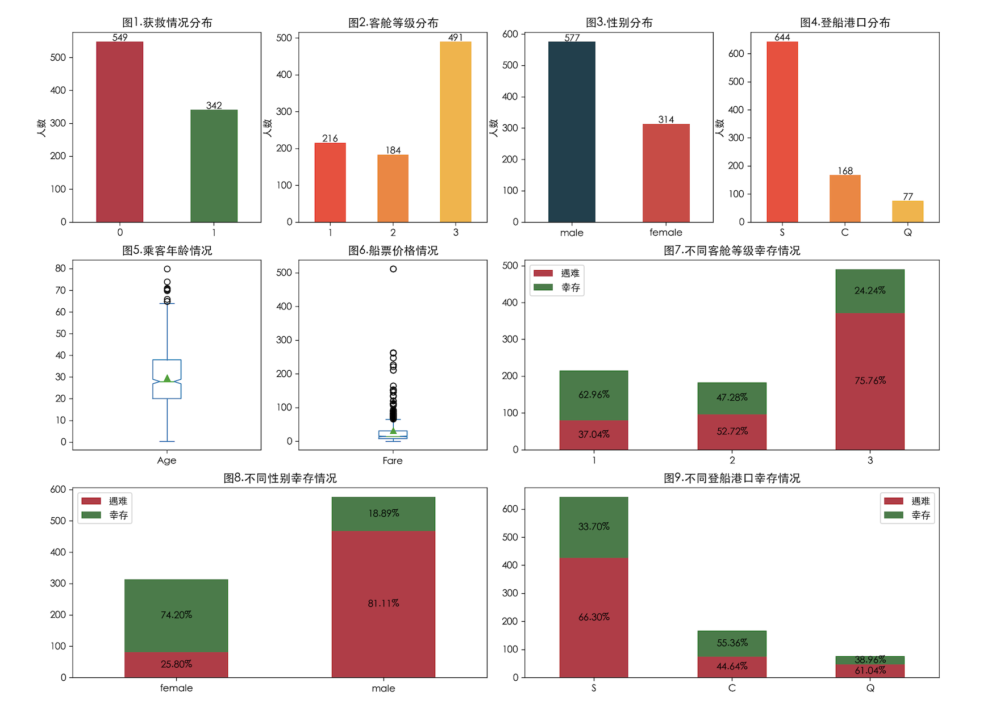
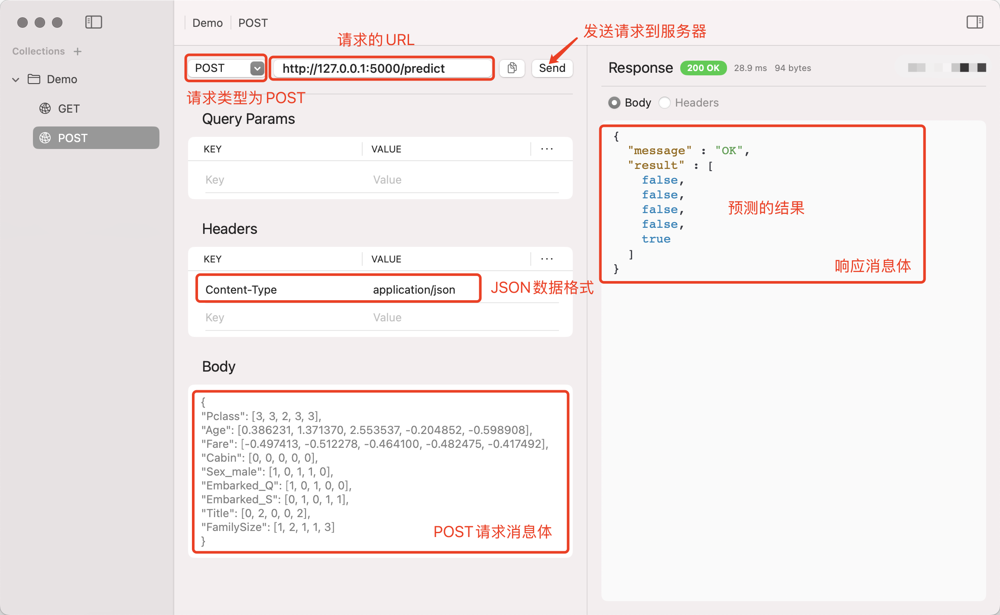

## 机器学习实战

本章我们通过经典的“泰坦尼克号生存预测”项目为大家讲解机器学习的完整应用，该项目来自于全球知名的数据科学竞赛平台[Kaggle](https://www.kaggle.com/)。该平台是数据科学、机器学习、人工智能领域的重要社区之一，为数据科学家和算法工程师提供了一个实践、分享和竞争的空间。无论是新手还是经验丰富的专家，Kaggle 都能为其提供丰富的资源和挑战，通过平台提供的数据集、竞赛、课程等资源，用户可以根据自身的需求提升相关的数据科学技能并与全球的数据科学家互动。

泰坦尼克号生存预测项目是 Kaggle 上最著名的入门级机器学习项目之一。该项目要求你根据乘客的基本信息（如年龄、性别、舱位、登船地等）预测他们是否能够在泰坦尼克号沉船事件中幸存下来，属于典型的分类任务。我们可以在 Kaggle 网站的 Competitions 搜索到名为“[*Titanic - Machine Learning from Disaster*](https://www.kaggle.com/competitions/titanic/)”的项目，点击进入可以看到项目的背景介绍并找到下载数据文件`train.csv`和`test.csv`的链接，显然前者是训练集（包含特征和标签）而后者是测试集（只有特征）。我们可以下载数据文件到本地并训练模型，然后再提交自己的预测结果；当然，如果愿意也可以在线创建 Notebook 文件并编写和运行代码。

### 数据探索

我们首先加载训练模型的数据，假设数据文件保存在当面路径下名为`data`的目录中，代码如下所示。

```python
import numpy as np
import pandas as pd

df = pd.read_csv('data/train.csv', index_col='PassengerId')
df.head(5)
```

输出：

```
			Survived Pclass	Name			Sex		Age		SibSp	Parch	Ticket		Fare	Cabin	Embarked
PassengerId											
1			0		 3		Braund, ...	    male	22.0	1		0		A/5 ...		7.2500	NaN		S
2			1		 1		Cumings, ...	female	38.0	1		0		PC ...		71.2833	C85		C
3			1		 3		Heikkinen, ...  female	26.0	0		0		STON/O2 ...	7.9250	NaN		S
4			1		 1		Futrelle, ...   female	35.0	1		0		113803 ...	53.1000	C123	S
5			0		 3		Allen, ...	    male	35.0	0		0		373450 ...	8.0500	NaN		S
```

> **注意**：加载数据的时候，我们直接将 PassengerID （乘客编号）列处理成了行索引。

下面的数据字典对`DataFrame`每个列的含义进行了说明。

| 列名       | 含义             | 说明                                                |
| ---------- | ---------------- | --------------------------------------------------- |
| `Survived` | 是否幸存         | 目标类别（`1`表示幸存，`0`表示遇难）                |
| `Pclass`   | 舱位等级         | 整数，取值为`1`、`2`、`3`，表示三种不同的等级       |
| `Name`     | 乘客姓名         | 字符串                                              |
| `Sex`      | 性别             | 字符串，`male`为男性，`female`为女性                |
| `Age`      | 年龄             | 浮点数                                              |
| `SibSp`    | 平辈亲属登船人数 | 整数，包括兄弟、姐妹、配偶总共登船的人数            |
| `Parch`    | 父母小孩登船人数 | 整数                                                |
| `Ticket`   | 船票号           | 字符串                                              |
| `Fare`     | 船票价格         | 浮点数                                              |
| `Cabin`    | 客舱号           | 字符串                                              |
| `Embarked` | 登船港口         | 字符串，`C`表示瑟堡，`Q`表示皇后镇、`S`表示南安普顿 |

我们对数据进行可视化操，通过统计图表实训对数据的初步探索，代码如下所示。

```python
import matplotlib.pyplot as plt

# 修改配置添加中文字体
plt.rcParams['font.sans-serif'].insert(0, 'SimHei')
plt.rcParams['axes.unicode_minus'] = False

# 定制画布
plt.figure(figsize=(16, 12), dpi=200)

# 遇难和获救人数分布
plt.subplot(3, 4, 1)
ser = df.Survived.value_counts()
ser.plot(kind='bar', color=['#BE3144', '#3A7D44'])
plt.xticks(rotation=0)
plt.title('图1.获救情况分布')
plt.ylabel('人数')
plt.xlabel('')
for i, v in enumerate(ser):
    plt.text(i, v, v, ha='center')

# 客舱等级人数分布
plt.subplot(3, 4, 2)
ser = df.Pclass.value_counts().sort_index()
ser.plot(kind='bar', color=['#FA4032', '#FA812F', '#FAB12F'])
plt.xticks(rotation=0)
plt.ylabel('人数')
plt.xlabel('')
plt.title('图2.客舱等级分布')
for i, v in enumerate(ser):
    plt.text(i, v, v, ha='center')

# 性别人数分布
plt.subplot(3, 4, 3)
ser = df.Sex.value_counts()
ser.plot(kind='bar', color=['#16404D', '#D84040'])
plt.xticks(rotation=0)
plt.ylabel('人数')
plt.xlabel('')
plt.title('图3.性别分布')
for i, v in enumerate(ser):
    plt.text(i, v, v, ha='center')

# 登船港口人数分布
plt.subplot(3, 4, 4)
ser = df.Embarked.value_counts()
ser.plot(kind='bar', color=['#FA4032', '#FA812F', '#FAB12F'])
plt.xticks(rotation=0)
plt.ylabel('人数')
plt.xlabel('')
plt.title('图4.登船港口分布')
for i, v in enumerate(ser):
    plt.text(i, v, v, ha='center')

# 乘客年龄箱线图
plt.subplot(3, 4, 5)
df.Age.plot(kind='box', showmeans=True, notch=True)
plt.title('图5.乘客年龄情况')

# 船票价格箱线图
plt.subplot(3, 4, 6)
df.Fare.plot(kind='box', showmeans=True, notch=True)
plt.title('图6.船票价格情况')

# 不同客舱等级遇难和幸存人数分布
plt.subplot(3, 4, (7, 8))
s0 = df[df.Survived == 0].Pclass.value_counts()
s1 = df[df.Survived == 1].Pclass.value_counts()
temp = pd.DataFrame({'遇难': s0, '幸存': s1})
pcts = temp.div(temp.sum(axis=1), axis=0)
temp.plot(ax=plt.gca(), kind='bar', stacked=True, color=['#BE3144', '#3A7D44'])
for i, idx in enumerate(temp.index):
    plt.text(i, temp.at[idx, '遇难'] // 2, f'{pcts.at[idx, "遇难"]:.2%}', ha='center', va='center')
    plt.text(i, temp.at[idx, '遇难'] + temp.at[idx, '幸存'] // 2, f'{pcts.at[idx, "幸存"]:.2%}', ha='center', va='center')
plt.xticks(rotation=0)
plt.xlabel('')
plt.title('图7.不同客舱等级幸存情况')

# 不同性别遇难和幸存人数分布
plt.subplot(3, 4, (9, 10))
s0 = df[df.Survived == 0].Sex.value_counts()
s1 = df[df.Survived == 1].Sex.value_counts()
temp = pd.DataFrame({'遇难': s0, '幸存': s1})
pcts = temp.div(temp.sum(axis=1), axis=0)
temp.plot(ax=plt.gca(), kind='bar', stacked=True, color=['#BE3144', '#3A7D44'])
for i, idx in enumerate(temp.index):
    plt.text(i, temp.at[idx, '遇难'] // 2, f'{pcts.at[idx, "遇难"]:.2%}', ha='center', va='center')
    plt.text(i, temp.at[idx, '遇难'] + temp.at[idx, '幸存'] // 2, f'{pcts.at[idx, "幸存"]:.2%}', ha='center', va='center')
plt.xticks(rotation=0)
plt.xlabel('')
plt.title('图8.不同性别幸存情况')

# 不同登船港口遇难和幸存人数分布
plt.subplot(3, 4, (11, 12))
s0 = df[df.Survived == 0].Embarked.value_counts()
s1 = df[df.Survived == 1].Embarked.value_counts()
temp = pd.DataFrame({'遇难': s0, '幸存': s1})
pcts = temp.div(temp.sum(axis=1), axis=0)
temp.plot(ax=plt.gca(), kind='bar', stacked=True, color=['#BE3144', '#3A7D44'])
for i, idx in enumerate(temp.index):
    plt.text(i, temp.at[idx, '遇难'] // 2, f'{pcts.at[idx, "遇难"]:.2%}', ha='center', va='center')
    plt.text(i, temp.at[idx, '遇难'] + temp.at[idx, '幸存'] // 2, f'{pcts.at[idx, "幸存"]:.2%}', ha='center', va='center')
plt.xticks(rotation=0)
plt.xlabel('')
plt.title('图9.不同登船港口幸存情况')

plt.show()
```

输出：



从上面的统计图表可以看出，一等舱的乘客有更高的存活率，女性乘客相较于男性乘客也有更高的存活率，在瑟堡登船的用户存活率较其他两地更高。如果愿意，我们还可以尝试对性别、舱位、年龄等维度进行交叉组合并绘制出对应的统计图表，甚至还可以探索乘客姓名中的称谓（`Mr`、`Miss`、`Mrs`、`Dr`、`Master`、`Major`等）跟乘客能否幸存是否存在某种关系，有兴趣的读者可以自行研究。

我们进一步查看`DataFrame`对象相关信息。

```python
df.info()
```

输出：

```
<class 'pandas.core.frame.DataFrame'>
Index: 891 entries, 1 to 891
Data columns (total 11 columns):
 #   Column    Non-Null Count  Dtype  
---  ------    --------------  -----  
 0   Survived  891 non-null    int64  
 1   Pclass    891 non-null    int64  
 2   Name      891 non-null    object 
 3   Sex       891 non-null    object 
 4   Age       714 non-null    float64
 5   SibSp     891 non-null    int64  
 6   Parch     891 non-null    int64  
 7   Ticket    891 non-null    object 
 8   Fare      891 non-null    float64
 9   Cabin     204 non-null    object 
 10  Embarked  889 non-null    object 
dtypes: float64(2), int64(4), object(5)
memory usage: 83.5+ KB
```

可以看出，训练集一共`891`条数据，其中年龄、客舱号、登船港口等列存在缺失值，乘客姓名、登船港口等是字符串类型没有办法直接用于模型训练，所以我们需要做一些准备工作。

### 特征工程

特征工程（Feature Engineering）是机器学习中的一个重要环节，通过对原始数据的处理、转换与选择，提取出能够帮助模型更好理解数据的特征，最终提升模型的预测性能。特征工程的主要步骤包括：

1. **数据清洗**：处理数据中的缺失值、重复值、异常值等。

2. **特征转换**：将原始数据转化为更适合模型输入的形式。常见的特征转换方法有：

    - 标准化和归一化：标准化将数据转换为均值为`0`、标准差为`1`的分布；归一化将数据缩放到特定的范围（如：$\small{[0, 1]}$），确保各特征在同一数量级，对应的公式如下所示：
        $$
        X^{\prime} = \frac{X - \mu}{\sigma}
        $$

        $$
        X^{\prime} = \frac{X - X_{min}}{X_{max} - X_{min}}
        $$

        其中，$\small{\mu}$表示数据的均值，$\small{\sigma}$表示数据的标准差，$\small{X_{min}}$表示数据中的最小值，$\small{X_{max}}$表示数据中的最大值。Scikit-learn 库`preprocessing`模块中的`StandardScaler`和`MinMaxScaler`可以实现数据的标准化和归一化。

    - 类别编码：对于类别变量（如：性别、职业、地区等），常用的编码方式有独热编码（One-Hot Encoding）和标签编码（Label Encoding）。Scikit-learn 库`preprocessing`模块中的`OneHotEncoder`和`LabelEncoder`可以实现数据的独热编码和标签编码，当然也可以通过 pandas 库的`get_dummies`函数来处理`DataFrame`中的类别变量。

    - 对数变换：对数变换可以帮助处理具有偏态分布的特征，使其更接近正态分布。

3. **特征选择**：从大量的特征中筛选出对模型预测有用的特征，去除冗余或无关的特征，减少维度并提高模型的性能。常用的方法有：

    - **过滤法**：基于统计检验方法（如：卡方检验、皮尔逊相关系数等）选择最具区分度的特征。
    - **包裹法**：通过模型的性能来评估特征子集的效果（如：递归特征消除法）。
    - **嵌入法**：通过训练模型并从模型中提取特征的重要性（如：决策树、L1正则化等），从而进行特征选择。

4. **特征降维**：通过某种数学变换将数据从高维空间映射到低维空间，以便保留数据的主要信息，简化模型，降维后的新特征是原始特征的某种组合。降维可以减少模型训练的运算量，减少不必要的噪声和冗余特征来降低复杂性，从而提高模型的泛化能力。特征降维常用的方法有：

    - **PCA**（主成分分析）：PCA 的目标是找出数据中最重要的特征（主成分），这些主成分能够保留数据的大部分方差。PCA 通过线性变换将数据投影到新的坐标轴上，使得投影后的数据方差最大化。换句话说，PCA通过对数据的特征进行“旋转”，将其转换为一个新的坐标系，新坐标系的每个轴（即主成分）按数据的方差大小排列，前几个主成分通常就能够解释数据的大部分变异。Scikit-learn 库`decomposition`模块的`PCA`类可以帮助我们完成主成分分析。
    - **LDA**（线性判别分析）：LDA 的主要目标是通过寻找最佳的投影方向来最大化不同类别之间的可分性，并同时最小化同一类别内数据点的散布。LDA在特征空间中找到一个低维的空间，使得类别之间的差异尽可能大，而同一类别内的数据尽量聚集。简单的说，LDA 的核心思想是**最大化类间散度，最小化类内散度**。Scikit-learn 库`discriminant_analysis`模块的`LinearDiscriminantAnalysis`类可以帮助我们完成线性判别分析。
    - **t-SNE**（t分布随机邻居嵌入）：t-SNE 是一种非线性的降维方法，主要用于数据可视化，特别适用于高维数据（如图像、文本等）的降维。t-SNE的目标是将高维空间中的相似点（邻近点）映射到低维空间中的相近位置，同时尽量避免不同类别之间的重叠。Scikit-learn 库`manifold`模块的`TSNE`类可以帮助我们完成t分布随机邻居嵌入。

5. **特征构造**：通过原始特征组合、变换或派生出新的特征。

特征工程不仅是提高模型准确性的关键因素，也是机器学习中一个需要持续优化的过程。通过对数据进行精心的清洗、转换、选择和构造，可以为模型提供更有价值的信息，提高模型的表现。尽管特征工程看似复杂，但它的效果在很多情况下超出了模型本身的改进，因此在实际应用中，我们应投入足够的精力和时间来进行特征工程的优化。

对于我们加载的数据集，我们可以将年龄字段的缺失值处理为中位数，将登船港口的缺失值处理为众数，客舱号字段的缺失值比较多，一种处理方式是直接删除这个列，另一种处理方式是二值化，有客舱号的记为`1`，没有客舱号的记为`0`，代码如下所示。

```python
df['Age'] = df.Age.fillna(df.Age.median())
df['Embarked'] = df.Embarked.fillna(df.Embarked.mode()[0])
df['Cabin'] = df.Cabin.replace(r'.+', '1', regex=True).replace(np.nan, 0).astype('i8')
```

处理完缺失值后，我们对年龄和船票价格两个字段进行特征缩放，通过`StandardScaler`实现标准化，代码如下所示。

```python
from sklearn.preprocessing import StandardScaler

scaler = StandardScaler()
df[['Fare', 'Age']] = scaler.fit_transform(df[['Fare', 'Age']])
```

接下来，还需要对性别和登船港口两个字段进行独热编码处理，可以使用 pandas 库中的`get_dummies`函数或 scikit-learn 库的`OneHotEncoder`处理，两者处理的结果类似，代码如下所示。

```python
df = pd.get_dummies(df, columns=['Sex', 'Embarked'], drop_first=True)
```

我们继续处理乘客姓名字段，根据姓名中的称谓衍生出一个新的特征；此外，对于`SibSp`和`Parch`两个字段，我们可以将其衍生为家庭成员数量的新特征，代码如下所示。

```python
title_mapping = {
    'Mr': 0, 'Miss': 1, 'Mrs': 2, 'Master': 3, 'Dr': 4, 'Rev': 5, 'Col': 6, 'Major': 7, 
    'Mlle': 8, 'Ms': 9, 'Lady': 10, 'Sir': 11, 'Jonkheer': 12, 'Don': 13, 'Dona': 14, 'Countess': 15
}
df['Title'] = df['Name'].map(
    lambda x: x.split(',')[1].split('.')[0].strip()
).map(title_mapping).fillna(-1)
df['FamilySize'] = df['SibSp'] + df['Parch'] + 1
```

> **说明**：我们将每个称谓映射到一个数字，这里不必过于纠结称谓跟数字的对应关系，而且有些称谓在我们的训练集中并没有出现。对于那些未知的称谓，我们统一处理为`-1`。

完成上面的操作之后，我们可以把不必要的字段全部删除掉，数据的准备工作就基本完成了。

```python
df.drop(columns=['Name', 'SibSp', 'Parch', 'Ticket'], inplace=True)
```

### 模型训练

首先我们将数据集划分为训练集和验证集，注意这里不是划分训练集和测试集，因为我们最终的测试集是官方提供的`test.csv`文件，这里我们把`train.csv`中 90% 的数据划分出来训练模型，用剩下的 10% 对模型进行验证。下面的代码中我们将验证集的特征和标签分别命名为`X_valid`和`y_valid`。

```python
from sklearn.model_selection import train_test_split

X, y = df.drop(columns='Survived'), df.Survived
X_train, X_valid, y_train, y_valid = train_test_split(X, y, train_size=0.9, random_state=3)
```

我们先尝试逻辑回归模型，代码如下所示。

```python
from sklearn.linear_model import LogisticRegression
from sklearn.metrics import classification_report

model = LogisticRegression(penalty='l1', tol=1e-6, solver='liblinear')
model.fit(X_train, y_train)
y_pred = model.predict(X_valid)
print(classification_report(y_valid, y_pred))
```

输出：

```
              precision    recall  f1-score   support

           0       0.88      0.80      0.84        56
           1       0.72      0.82      0.77        34

    accuracy                           0.81        90
   macro avg       0.80      0.81      0.80        90
weighted avg       0.82      0.81      0.81        90
```

我们再试一试大杀器 XGBoost，代码如下所示。

```python
import xgboost as xgb

# 将数据处理成数据集格式DMatrix格式
dm_train = xgb.DMatrix(X_train, y_train)
dm_valid = xgb.DMatrix(X_valid)

# 设置模型参数
params = {
    'booster': 'gbtree',             # 用于训练的基学习器类型
    'objective': 'binary:logistic',  # 指定模型的损失函数
    'gamma': 0.1,                    # 控制每次分裂的最小损失函数减少量
    'max_depth': 10,                 # 决策树最大深度
    'lambda': 0.5,                   # L2正则化权重
    'subsample': 0.8,                # 控制每棵树训练时随机选取的样本比例
    'colsample_bytree': 0.8,         # 用于控制每棵树或每个节点的特征选择比例
    'eta': 0.05,                     # 学习率
    'seed': 3,                       # 设置随机数生成器的种子
    'nthread': 16,                   # 指定了训练时并行使用的线程数
}

model = xgb.train(params, dm_train, num_boost_round=200)
y_pred = model.predict(dm_valid)
# 将预测的概率转换为类别标签
y_pred_label = (y_pred > 0.5).astype('i8')
print(classification_report(y_valid, y_pred_label))
```

输出：

```
              precision    recall  f1-score   support

           0       0.89      0.91      0.90        56
           1       0.85      0.82      0.84        34

    accuracy                           0.88        90
   macro avg       0.87      0.87      0.87        90
weighted avg       0.88      0.88      0.88        90
```

当然，在条件允许的情况下，**强烈建议**大家通过网格搜索交叉验证的方式对模型的超参数进行调优，同时我们还可以绘制**学习曲线**（learning curve）来辅助判定是否存在过拟合和欠拟合问题。学习曲线包含两条曲线，一条反映训练误差，一条反映验证误差。欠拟合通常表现为模型在训练集和验证集上的误差都较大，并且随着训练数据增加，训练误差和验证误差的差距较小，说明我们的模型过于简单，无法捕捉到数据中的模式。过拟合通常表现为模型在训练集上表现得很好（训练误差较低），但在验证集上表现较差（验证误差较高），且随着训练数据增加，训练误差持续降低而验证误差开始上升时，说明我们的模型过于复杂。Scikit-learn 库`model_selection`模块的`learning_curve`函数可以帮助我们绘制学习曲线，有兴趣的读者可以自行研究。

### 模型评估

接下来我们加载真正的测试数据`test.csv`，通过前面训练好的模型来做出预测。我们可以将预测的结果保存成一个 CSV 文件，该文件共有两列，一列是 PassengerID，一列是我们预测的结果。我们将该文件提交到 Kaggle 平台，可以获得最终模型的准确率评分。

```python
test = pd.read_csv('data/test.csv', index_col='PassengerId')
# 处理缺失值
test['Age'] = test.Age.fillna(test.Age.median())
test['Fare'] = test.Fare.fillna(test.Fare.median())
test['Embarked'] = test.Embarked.fillna(test.Embarked.mode()[0])
test['Cabin'] = test.Cabin.replace(r'.+', '1', regex=True).replace(np.nan, 0).astype('i8')
# 特征缩放
test[['Fare', 'Age']] = scaler.fit_transform(test[['Fare', 'Age']])
# 处理类别
test = pd.get_dummies(test, columns=['Sex', 'Embarked'], drop_first=True)
# 特征构造
test['Title'] = test['Name'].apply(lambda x: x.split(',')[1].split('.')[0].strip()).map(title_mapping).fillna(-1)
test['FamilySize'] = test['SibSp'] + test['Parch'] + 1
# 删除多余特征
test.drop(columns=['Name', 'Ticket', 'SibSp', 'Parch'], inplace=True)

# 使用逻辑回归模型
passenger_id, X_test = test.index, test
# 使用XGBoost模型
# passenger_id, X_test = test.index, xgb.DMatrix(test)

y_test_pred = model.predict(X_test)
# XGoost模型 - 将预测的概率转换成类别标签
# y_test_pred = (model.predict(X_test) > 0.5).astype('i8')

# 生成提交文件
result = pd.DataFrame({
    'PassengerId': passenger_id,
    'Survived': y_test_pred
})
result.to_csv('submission.csv', index=False)
```

大家可以试一试，不同的模型预测结果是否存在较大的差异，哪个是你心目中最理想的模型，然后大家可以通过实验验证我们之前提到的一个观点，看看特征工程是不是对预测的结果有重要的影响。下面是我对特征工程的一些小建议（仅供参考），大家可以自行实践，看看能否通过这些操作提升模型的性能。

1. 对年龄（Age）字段进行离散化（分箱），将年龄特别小的（儿童）单独处理（如增加一个布尔字段）。
2. 对客舱号（Cabin）字段进行更细致的处理，提取前缀字母和后续数字作为特征，而不是简单的二值化。
3. 对比较重要的两个特征舱位等级（Pclass）和性别（Sex）进行特征组合。
4. 对名字（Name）中有 Mrs 且父母小孩登船人数大于1的（可能是一位母亲）单独处理（如增加一个布尔字段）。
5. 删除掉登船港口（Embarked）字段。

### 模型部署

我们可以将训练好的模型部署到工程化项目中，首先需要对模型进行序列化处理，代码如下所示。

```python
import joblib

joblib.dump(model, 'model.pkl')
```

> **说明**：此处我们默认上面代码中的`model`对象是之前通过 XGBoost 训练的模型。 

`joblib`模块的`dump`函数对模型进行了 Pickle 序列化（Python私有序列化协议），在需要使用模型的地方，我们可以通过`load`函数实现反序列化，这样就可以将模型加载到应用程序中并完成预测，代码如下所示。

```python
import joblib

model = joblib.load('model.pkl')
model.predict(X_test)
```

> **说明**：此处我们默认上面代码中的`X_test`已经处理为 XGBoost 中`DMatrix`对象。

如果我们希望将模型部署成 Web 服务，可以利用 Flask、FastAPI 这样的 Web 框架来创建 API 接口。下面，我们以 Flask 框架为例，用简单的代码为大家演示这个过程。

```python
from flask import Flask
from flask import jsonify
from flask import request

import joblib
import pandas as pd
import xgboost as xgb

app = Flask(__name__)


@app.route('/predict', methods=['POST'])
def predict():
    query_df = pd.DataFrame(request.json)
    model = joblib.load('model.pkl')
    y_pred = (model.predict(xgb.DMatrix(query_df)) > 0.5).tolist()
    return jsonify({'message': 'OK', 'result': y_pred})


if __name__ == '__main__':
    app.run(debug=True)
```

> **说明**：作为工程化的项目，肯定不能在请求到来时才加载模型，因为这样会严重影响 Web 服务的性能。可以在项目启动之后的适当时机提前加载需要的模型，与此同时还要根据实际需求做好模型资源占用的监控。

运行上面的代码，默认会在本机 5000 端口运行一个 Web 服务器，下面我们通过 API 测试工具模拟发送一个 HTTP 请求给服务器，看看我们的模型能否运转起来给出预测的结果。



除了把模型部署成 Web 服务之外，我们还可以将模型部署到定时任务中，通过时间自动激发对模型的调用。此外，一些边缘设备支持我们将训练好的模型以某种特殊的格式嵌入进去，有兴趣的读者可以自行探索。
