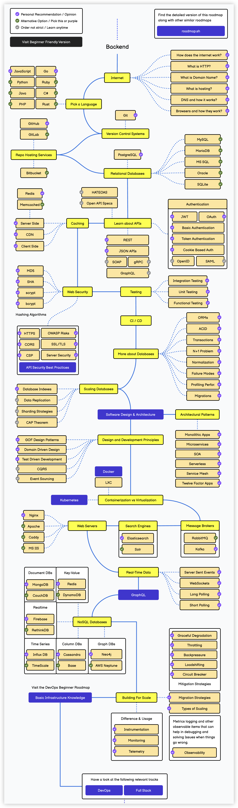
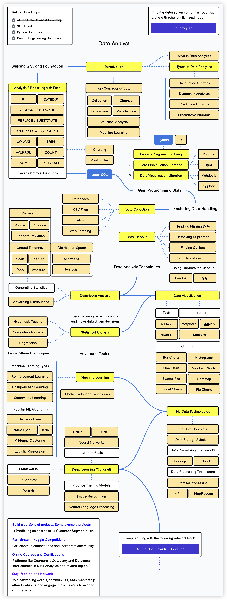

## 分享几张学习路线图

今天逛了一个名为 [Developer Roadmaps](https://roadmap.sh) 的网站，上面就有好多的学习路线图。其中有一张关于 Python 的学习路线图还不错，分享给大家。如果用 Python 做工程化开发（后端开发、接口开发、应用开发等），这张图上的内容基本都是需要涉猎的；如果仅仅是将 Python 作为辅助工具，学习之前给大家整理的[《从零开始学Python》](https://www.zhihu.com/column/c_1216656665569013760)的 20 节课就已经足够了。近期，我也在重置这 20 节课的内容，重置后的内容会标记为“2025版”，也希望在这个过程中听到大家的意见和建议。

这里还有三个相关的学习路线图，分别是后端开发（Backend）、开发运维（DevOps）和数据科学（Data Science），后端开发的学习路线图如下所示，内容比较庞杂，核心的编程语言是 Java 或 Go。我个人不推荐大家用 Python 做后端开发，如果 Python 语言已经掌握得很好了，同时也具备了较多的计算机科学相关知识，可以尝试 AI 应用开发这个赛道，我相信你会有更多的收获。大家可以注意下用紫色勾选的项目，这些是作者推荐的选项，大部分也是我想推荐给后端开发者学习的内容。

我们再看看开发运维的学习路线图，目前 DevOps 也是招聘市场的热门岗位，有兴趣的小伙伴可以关注下。

如果学过一些 Python 相关知识，想以此为基础转行做数据分析，可以看看下面这个学习路线图。需要说明的是，Python 仅仅是做数据分析的一个工具，要成为一个优秀的数据分析师需要有良好的数据思维，同时还要积累足够的业务知识，这样才能从数据中产生商业洞察，用数据优化产品、驱动业务，真正为决策提供强有力的支撑。

最后，再次提醒大家，想打卡学习的一定记得在[评论区](https://zhuanlan.zhihu.com/p/23821670129)给我留言！如果想**入坑数据科学**（数据分析、数据挖掘、数据治理等）也可以给我留言，今年应该会持续输出相关的内容。

