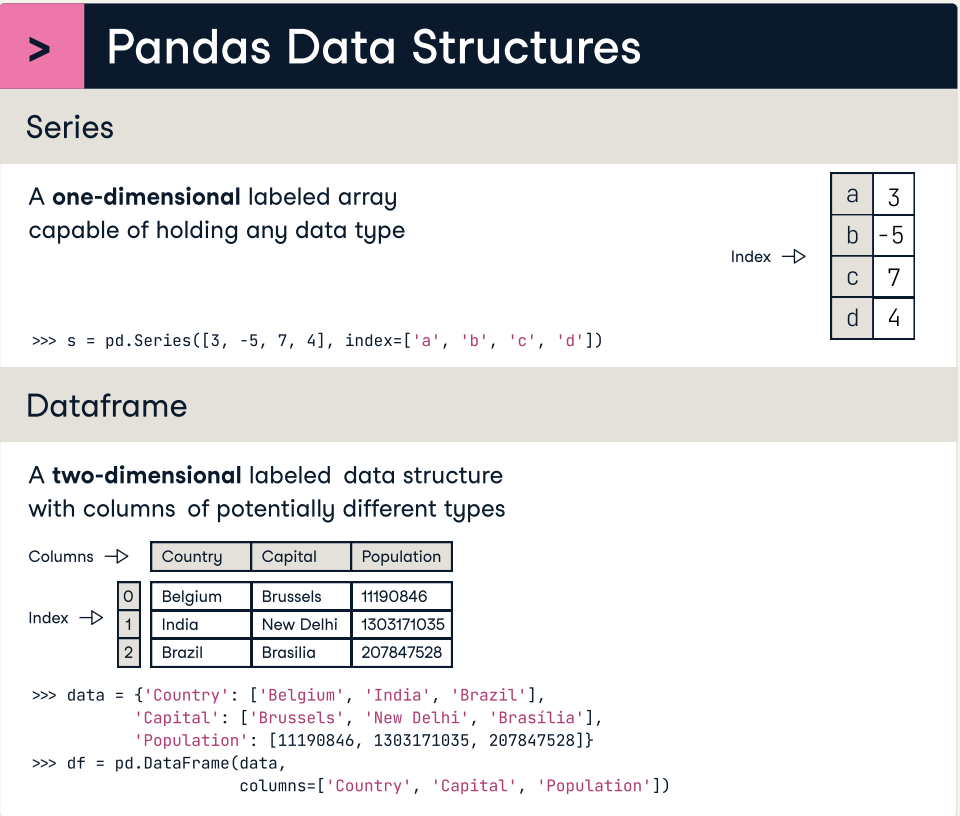
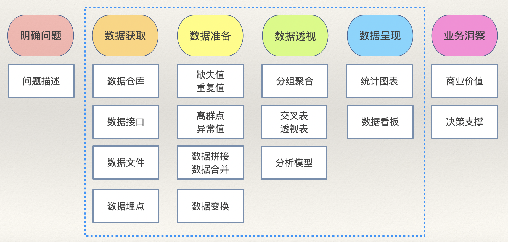

## 如何快速驾驭 pandas 库

最近有小伙伴提到，Python 做数据分析的 pandas 库函数和方法实在太多，感觉学习和使用起来思路都非常混乱。之前回复过这个问题，今天把它更系统的整理一下，毕竟这个库是 Python 数据科学生态圈中扮演着极为重要的角色，虽然目前有很多 pandas 库的替代品（如：polars、cuDF等），但是使用方法跟 pandas 可以说是大同小异。

### 三个核心类

Pandas 库有三个最核心的类，其中最重要的是`DataFrame`类型，它是学习的重点，如下图所示。



1. `Series`：表示一维数据，跟一维数组类似（带标签的数组），每个数据都有自己的索引（标签），可以通过索引访问数据。
2. `DataFrame`：表示二维数据，类似于 Excel 电子表格，行和列都有自己的索引（标签），可以通过索引访问行、列、单元格。
3. `Index`：表示索引，为`Series`和`DataFrame` 提供索引服务，`Index`有很多的子类型，适用于需要不同类型的索引的场景。

### 数据分析流程

学习和使用 pandas 重点是`DataFrame`的应用，我们建议大家按照数据分析的流程来掌握对应的函数和方法，这样做往往会事半功倍。数据分析流程如下图所示，其中蓝色虚线圈中的部分就是可以通过 BI 工具（如：Power BI、Tableau等）或 Python 程序来完成的部分。



#### 数据获取

数据获取也可以称为数据加载，其本质就是创建`DataFrame`对象，需要掌握以下几个函数：

1. 从 CSV 文件加载数据。

```python
pd.read_csv(
    filepath,      # CSV文件路径（可以本地绝对路径或相对路径，也可以是一个URL）
    sep,           # 字段分隔符（默认是逗号）
    header,        # 表头在第几行
    encoding,      # 文件编码（默认utf-8）
    quotechar,     # 包裹字符串的符号（默认是双引号）
    usecols,       # 加载哪些列
    index_col,     # 指定索引列
    dtype,         # 指定列的数据类型
    converters,    # 指定列的数据转换器
    nrows,         # 加载多少行数据
    skiprows,      # 指定需要跳过的行
    parse_dates,   # 将哪些列解析为日期时间
    date_format,   # 日期格式
    true_values,   # 被视为布尔值True的值
    false_values,  # 被视为布尔值False的值
    na_values,     # 被视为空值的值
    na_filter,     # 是否检测空值标记
    on_bad_lines,  # 遇到有问题的行如何处理（可选项：'error'、'warn'、'skip'）
    engine,        # 指定底层引擎（例如：可以使用更快的Arrow引擎来处理体量更大的数据）
    iterator,      # 是否开启迭代器模式（处理大数据时减少内存开销）
    chunksize,     # 迭代器模式下每次加载数量的体量
)
```

2. 从 Excel 文件加载数据。

```python
pd.read_excel(
    io,           # 工作簿文件的路径
    sheet_name,   # 工作表的名字
    skip_footer,  # 跳过末尾多少行
)
```

> **说明**：`read_excel`函数跟`read_csv`有很多作用相同的参数，这里就没有赘述了。从 Excel 文件中加载数据时，没有迭代器模式。

3. 从数据库或数仓加载数据。

```python
pd.read_sql(
    sql,          # SQL查询或二维表的名字
    con,          # 数据库连接
    parse_dates,  # 指定需要解析成日期的列
    index_col,    # 指定索隐裂
    columns,      # 需要加载的列
    chunksize,    # 加载数据的体量
    dtype,        # 指定列的数据类型
)
```

4. 其他创建`DataFrame`对象的方式。

```python
pd.DataFrame(data=[[95, 87], [66, 78], [92, 89]], index=[1001, 1002, 1003], columns=['Verbal', 'Math'])
pd.DataFrame(data={'Verbal': [95, 66, 92], 'Math': [87, 78, 89]}, index=[1001, 1002, 1003])
```

如果要对`DataFrame`中的数据或索引进行操作，需要掌握下面的运算和方法。

1. 查看信息

```python
df.info()
```

2. 查看前/后 N 行

```python
df.head(10)
df.tail(5)
```

3. 操作列

```python
df['column_name']
df.colume_name
```

4. 操作行

```python
df.loc['row_index']
df.iloc[0]
```

5. 操作单元格

```python
df.at['row_index', 'column_name']
df.iat[0, 0]
```

6. 删除行或列

```python
df.drop(
    labels,   # 要删除的行或列的索引
    axis,     # axis=0，labels表示行索引；axis=1，labels表示列索引
    index,    # 要删除的行的索引
    columns,  # 要删除的列的索引
    inplace,  # 是否就地删除（inplace=True，表示就地删除不返回新DataFrame对象）
)
```

7. 筛选数据

```python
df.query(expr)  # 通过表达式指定筛选条件
df[bool_index]  # 布尔索引
```

8. 随机抽样

```python
df.sampe(
    n,             # 样本容量
    frac,          # 抽样比例
    replace,       # 有放回或无放回抽样（默认值False）
    random_state,  # 随机数种子（种子相同每次抽样的结果相同）
)
```

9. 重置索引

```python
df.reset_index(
    level,    # 对于多级索引指定重置哪一级的索引
    drop,     # 是否丢弃索引（drop=False表示索引会被处理成普通列）
    inplace,  # 是否就地处理（要不要返回新的DataFrame对象）
)
```

10. 设置索引

```python
df.set_index(
   keys,              # 指定作为索引的列
   drop,              # 是否删除作为索引的列（默认值True）
   append,            # 是否将指定列加入现有的索引（默认值False）
   inplace,           # 是否就地处理（要不要返回新的DataFrame对象）
   verify_integrity,  # 检查索引列是否存在重复值（默认值False）
)
```

11. 调整索引顺序

```python
df.reindex()
df[fancy_index]       # 花式索引
df.loc[facy_index]    # 花式索引
df.iloc[fancy_index]  # 花式索引
```

12. 索引排序

```python
df.sort_index(
    axis,         # 确定行索引或列索引（默认值0）
    level,        # 对于多级索引指定索引的级别
    ascending,    # 升序或降序（默认值True）
    inplace,      # 是否就地排序
    kind,         # 排序算法（默认值'quicksort'）
    na_position,  # 空值放在最前还是最后（默认值'last'）
    key,          # 传入比较索引大小的函数（自定义比较规则）
)
```


#### 数据重塑

1. 拼接（类似于 SQL 中的 union 操作）

```python
pd.concat(
    objs,          # 保存多个DataFrame对象的容器
    axis,          # 沿着哪个轴进行拼接
    ignore_index,  # 是否忽略原来的索引（默认值False）
)
```

2. 合并（类似于 SQL 中的 join 操作）

```python
pd.merge(
    left,         # 左表
    right,        # 右表
    how,          # 指定连表的方式（默认值'inner'表示内连接）
    on,           # 指定连表字段（如果左右两表连表字段同名）
    left_on,      # 指定左表的连表字段
    right_on,     # 指定右表的连表字段
    left_index,   # 是否使用左表的索引连表
    right_index,  # 是否使用右表的索引连表
    suffixes,     # 指定同名列的后缀（默认值('_x', '_y')）
)
```


#### 数据清洗

1. 缺失值

```python
# 甄别缺失值
df.isna()
df.notna()
# 删除缺失值
df.dropna(
    axis,     # 删行或删列（默认值0）
    how,      # 是否存在任意一个缺失值就删除（默认值'any'）
    subset,   # 只对哪些行或列删除空值
    inplace,  # 是否就地删除（要不要返回新的DataFrame对象）
)
# 填充缺失值
df.fillna(
    value,    # 填充的值
    method,   # 填充空值的方法
    inplace,  # 是否就地填充（要不要返回新的DataFrame对象）
)
# 使用插值算法插值
df.interpolate(
    method,   # 插值算法（默认值'linear'表示线性插值法） 
    axis,     # 沿着哪个轴插值
    inplace,  # 是否就地插值（要不要返回新的DataFrame对象）
)
```

2. 重复值

```python
# 甄别重复值
df.duplicated(
    subset,   # 用于判断重复的列标签
    keep,     # 如何处理重复项（默认值'first'表示保留第一项）
)
# 删除重复值
df.drop_duplicates(
    subset,   # 用于判断重复的列标签
    keep,     # 如何处理重复项（默认值'first'表示保留第一项）
    inplace,  # 是否就地去重（默认值False）
)
# 统计非重复值
df.nunique(axis)
```

3. 异常值

异常值的处理重点在甄别，可以使用数值判定法、z-score 判定法、孤立森林等方法来进行甄别离群点，然后结合实际业务意义判定是不是异常值。对于异常值的处理，通常是替换或删除，删除可以用之前提到的`drop`方法删行或者删列。

```python
# 替换异常值
df.replace(
    to_replace,  # 被替换的值
    value,       # 替换的值
    inplace,     # 是否就地替换（要不要返回新的DataFrame对象）
    regex,       # 是否启动正则表达式替换（默认值False）
)
```

4. 预处理

预处理通常在`Series`对象上对数据进行操作，假设变量`s`是一个`Series`对象，具体的操作包括：

- 日期时间预处理

```python
s.dt.year                   # 年
s.dt.quarter                # 季度
s.dt.month                  # 月
s.dt.day                    # 日
s.dt.hour                   # 时
s.dt.minute                 # 分
s.dt.second                 # 秒
s.dt.weekday                # 星期几
s.dt.to_period(freq)        # 以特定频率转换
s.dt.floor(freq)            # 下取整
s.dt.ceil(freq)             # 上取整
s.dt.round(freq)            # 舍入
s.dt.strftime(date_format)  # 格式化
s.dt.tz_localize(tz)        # 时区本地化
s.dt.tz_convert(tz)         # 转换时区
```

- 字符串预处理

```python
s.str.lower()       # 字符串变小写
s.str.upper()       # 字符串变大写
s.str.title()       # 字符串首字母大写
# 字符串拆分
s.str.split(
    pat,            # 拆分字符或正则表达式
    n,              # 最大拆分次数
    expand,         # 是否将拆分后的内容展开成多个列（默认值False）
)
# 从字符串中捕获内容
s.str.extract(
    pat,            # 正则表达式
    flags,          # 正则表达式处理标记
    expand,         # 是否将捕获内容展开成多个列（默认值True）
)
s.str.isalpha()     # 检查字符串是不是字母
s.str.isnumeric()   # 检查字符串是不是数值
s.str.isalnum()     # 检查字符串是不是字母数字
s.str.isspace()     # 检查字符串是不是空白字符
s.str.startswith()  # 检查字符串是否以指定内容开头 
s.str.endswith()    # 检查字符串是否以指定内容结尾
# 检查字符串是否跟正则表达式匹配
s.str.match(
    pat,            # 正则表达式
    flags,          # 正则表达式处理标记
)
# 检查字符串是否包含指定内容
s.str.contains(
    pat,            # 字符串或正则表达式
    flags,          # 正则表达式处理标记
    regex,          # 是否使用正则表达式（默认值True）
)
# 替换
s.str.replace(
    pat,            # 被替换的内容（字符串或正则表达式）
    repl,           # 替换的内容
    n,              # 最大替换次数（默认值-1表示全部替换）
    flags,          # 正则表达式处理标记
    regex,          # 是否使用正则表达式（默认值True）
)
s.str.strip()       # 去掉字符串多余的空格
s.str.join(sep)     # 用指定的分隔符将内容拼接成字符串
# 字符串拼接
s.str.cat(
    others,         # 拼接的内容
    sep,            # 分隔符
    na_rep,         # 空值的替代符
)
s.str.len()         # 获得字符串长度
# 查找子串的位置
s.str.find(
    sub,            # 子串
    start,          # 起始位置
    end,            # 结束位置
)
```

- 类别预处理

```python
# 类别重排序
s.cat.reorder_categories(
    new_categories,  # 新的类别顺序
    inplace,         # 是否就地处理（默认值False）
)
# 添加类别
s.cat.add_categories(
    new_categories,  # 要添加的新类别
    inplace,         # 是否就地处理（默认值False）
)
# 移除类别
s.cat.remove_categories(
    removals,        # 要移除的类别
    inplace,         # 是否就地处理（默认值False）
)
# 移除没有使用的类别
s.cat.remove_unused_categories(
    inplace,         # 是否就地处理（默认值False）
)
# 类别重命名
s.cat.rename_categories(
    new_categories,  # 新的类别名称
    inplace,         # 是否就地处理（默认值False）
)
```

- 二值化（虚拟变量）

```python
pd.get_dummies(
    data,        # 需要转换为虚拟变量的Series或DataFrame
    prefix,      # 指定生成的虚拟变量列的前缀
    prefix_sep,  # 前缀和列名之间的分隔符
    dummy_na,    # 是否为空值（NaN）生成一个列（默认值False）
    columns,     # 指定要转换的列名
    drop_first,  # 是否从生成的虚拟变量中删除第一个类别的列（默认值False）
)
```

- 离散化（分箱）

```python
pd.cut(
    x,        # 要分割的输入数据（一维数据）
    bins,     # 分割的区间数或具体的区间边界
    right,    # 区间是否包含右端点（默认值False）
    labels,   # 指定每个区间的标签
    retbins,  # 是否返回分割的边界数组（默认值False）
    ordered,  # 返回的类别是否是有序的（默认值True）
)
pd.qcut(
    x,        # 要分割的输入数据（一维数据）
    q,        # 分割点的数量或具体的分位数
    labels,   # 指定每个区间的标签
    retbins,  # 是否返回分割的边界数组（默认值False）
)
```

- 自定义转换

```python
s.map(arg)          # 对数据进行元素级别的转换和映射
df.map(func)        # 对数据进行元素级别的转换和映射
# 通过指定函数对数据进行元素级别的转换
s.apply(
    func,           # 作用于每个元素的函数
    convert_type,   # 尝试将结果转换为最适合的类型（默认值True）
    args,           # 传递给func的额外位置参数
    kwargs,         # 传递给func的额外关键字参数
)   
# 通过指定函数对数据进行行级或列级的转换
df.apply(
    func,           # 作用域行或列的函数
    axis,           # 控制做行级还是列级转换
    result_type,    # 指定返回的类型（'expand'表示扩展为列，'reduce'表示返回标量，'broadcast'表示广播为原始形状）
    args,           # 传递给func的额外位置参数
    kwargs,         # 传递给func的额外关键字参数
)
s.transform(func)   # 通过指定一个或多个函数对数据进行元素级别的转换
df.transform(func)  # 通过指定一个或多个函数对数据进行行级或列级转换
```

#### 数据透视

1. 描述性统计信息

```python
s.mean()     # 均值
s.median()   # 中位数
s.mode()     # 众数
s.max()      # 最大值
s.min()      # 最小值
s.var(ddof)  # 方差（ddof代表自由度校正值）
s.std(ddof)  # 标准差（ddof代表自由度校正值）
s.skew()     # 偏态系数
s.kurt()     # 峰度系数
```

2. 相关性分析

```python
df.cov()         # 协方差
df.corr(method)  # 相关系数（默认'pearson'表示皮尔逊相关系数，可选值还有'kendall'和'spearman'）
```

3. 排序和头部值

```python
# 排序
s.sort_values(
    asending,     # 升序或降序（默认值True）
    inplace,      # 是否就地排序（默认值False）
    kind,         # 排序算法（默认值'quicksort'）
    na_position,  # 空值的位置（默认值'last'）
    key,          # 指定比较元素的规则（函数）
)
# 排序
df.sort_values(
    by,           # 排序的依据
    ascending,    # 升序或降序（默认值True）
    inplace,      # 是否就地排序（默认值False）
    kind,         # 排序算法（默认值'quicksort'）
    na_position,  # 空值的位置（默认值'last'）
    key,          # 指定比较元素的规则（函数）
)
# TopN元素（头部）
s.nlargest(
    n,            # 前N个最大值
    keep,         # 如何处理重复值（默认值'first'）
)
# TopN元素（头部）
df.nlargest(
    n,            # 前N个最大值
    columns,      # 指定用于排序的列名
    keep,         # 如何处理重复值（默认值'first'）
)
# TopN元素（尾部）
s.nsmallest(
    n,            # 前N个最小值
    keep,         # 如何处理重复值（默认值'first'）
)
# TopN元素（尾部）
df.nsmallest(
    n,            # 前N个最小值
    columns,      # 指定用于排序的列名
    keep,         # 如何处理重复值（默认值'first'）
)
```

4. 分组聚合

```python
df.groupby(
    by,          # 指定用于分组的列名
    level,       # 对于多级索引指定用哪一级分组
    as_index,    # 是否将分组的列设置为索引（默认值True）
    sort,        # 是否对分组的结果进行排序（默认值True）
    observed,    # 只考虑在数据中实际出现的分组（默认值False）
).aggregate(
    func,        # 单个函数或函数列表
    args,       # 函数的可变参数
    kwargs,    # 函数的关键字参数
)
df.pivot(
    index,       # 指定用作索引的列
    columns,     # 要作为新列的列 
    values,      # 用于填充新DataFrame中的值的列
)
df.melt(
    id_vars,     # 在转换过程中保持不变的列
    value_vars,  # 要转换为行的列
    var_name,    # 指定存储原列名的新列名
    value_name,  # 指定存储原数据值的新列名
)
```

5. 透视表

```python
pd.pivot_table(
    data,          # DataFrame对象
    values,        # 需要聚合的列
    index,         # 分组数据的字段（行索引）
    columns,       # 分组数据的字段（列索引）
    aggfunc,       # 聚合函数（默认值'mean'）
    fill_value,    # 填充空值的值
    margins,       # 是否计算行列总计（默认值False）
    margins_name,  # 总计列的名字（默认值'All'）
    observed       # 只考虑在数据中实际出现的分组（默认值False）
)
```

6. 交叉表

```python
pd.crosstab(
    index,         # 交叉表中的行变量
    columns,       # 交叉表中的列变量
    values,        # 用于填充交叉表的值（可选项）
    aggfunc,       # 聚合函数（可选项）
    margins,       # 是否计算行列总计（默认值False）
    margins_name,  # 总计列的名字（默认值'All'）
)
```

#### 数据呈现

```python
df.plot(
    figsize,   # 图表尺寸（二元组）
    kind,      # 图表类型
    ax,        # 绘图的坐标系
    x,         # 横轴数据
    y,         # 纵轴数据
    title,     # 图表标题
    grid,      # 是否绘制网格
    legend,    # 是否显示图例
    xticks,    # 横轴刻度
    yticks,    # 纵轴刻度
    xlim,      # 横轴取值范围
    ylim,      # 纵轴取值范围
    xlabel,    # 横轴标签
    ylabel,    # 纵轴标签
    rot,       # 轴标签旋转角度
    fontsize,  # 轴标签字体大小
    colormap,  # 颜色系列
    stacked,   # 是否绘制堆叠图（默认值False）
    colorbar,  # 是否显示色彩条
)
```

`plot`方法最重要的参数是`kind`，它可以控制图表的类型，具体如下所示：

1. 折线图：`kind='line'`
2. 散点图：`kind='scatter'`
3. 柱状图：`kind='bar'`
4. 条状图（水平柱状图）：`kind='barh'`
5. 饼状图：`kind='pie'`
6. 直方图：`kind='hist'`
7. 箱线图：`kind='box'`
8. 面积图：`kind='area'`
9. 核密度估计图：`kind='kde'`

### 总结

大家可以找一个数据集按照上面讲解的流程把这些最常用的类型、函数和方法过一遍，是不是印象就深刻一点了。更详细的内容还是推荐阅读我的专栏[《基于Python的数据分析》](https://www.zhihu.com/column/c_1217746527315496960)或者观看B站上的视频[《Python数据分析三剑客》](https://www.bilibili.com/video/BV13t4y1a7TV/)。